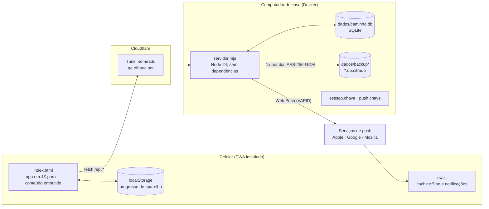

# Arquitetura do Geração Eleita

Documentação de como o app é montado, como as telas se ligam e por onde os dados passam.
Atualizada em 24/09/2026.

| Arquivo | O que tem |
|---|---|
| [`fluxo.html`](fluxo.html) | O quadro das telas, estilo Figma: as 31 telas nos dois temas, as setas de navegação e a análise de cada fluxo. Abra no navegador (arraste, role para aproximar, toque numa tela). |
| [`telas/`](telas/) | As capturas, `claro-*.png` e `escuro-*.png`. Refeitas com `ESCALA=1 node ferramentas/telas.mjs docs/arquitetura/telas ambos`. |
| [`relatorio-melhorias.md`](relatorio-melhorias.md) | O que pode melhorar, por prioridade, com base em boas práticas e em apps de mercado. |

## Visão geral



- **Sem framework e sem dependências npm.** O servidor usa só o Node (http, crypto, sqlite), e o app é JavaScript puro em módulos concatenados pelo build.
- **O conteúdo vai dentro do app.** O plano de 365 dias, as reflexões e as 546 notas ficam em `conteudo/conteudo.json` e são embutidos no `index.html` (4,9 MB, 1,1 MB comprimido). As duas Bíblias (NBV e Bíblia Livre) são arquivos à parte, com cache próprio.
- **Funciona sem internet.** O service worker guarda o app e as Bíblias. O progresso nasce no aparelho (`localStorage`) e é fundido com o servidor quando há rede.

## Build

`node build.mjs` monta o `dist/`:

1. junta `src/app/*.js` em ordem (01 a 10) num `<script>` dentro de `src/index.html`, junto com o `conteudo.json`;
2. copia as Bíblias com um resumo (hash) no nome e gera a versão `.gz`;
3. gera o `sw.js` com o nome do cache ligado à versão, o `manifest.webmanifest` e os ícones;
4. grava `index.html` e `index.html.gz`.

A versão publicada (`/api/versao`) é o hash do `index.html`. O app compara a versão dele com a do servidor, e o service worker novo assume sem recarregar a página na frente da pessoa: a versão nova entra quando a janela é fechada e aberta de novo.

## O app (src/app)

| Módulo | Responsabilidade |
|---|---|
| `01-nucleo.js` | utilidades (`CC.esc`, datas, ícones, folhas e confirmações) |
| `01c-arte.js` | ilustrações em SVG: medalha, troféu, baú, chama, confete |
| `02-estado.js` | progresso: leitura local, **fusão entre aparelhos**, envio ao servidor, tema, foto |
| `02b-jogo.js` | ofensiva, escudos, desafios, baús, conquistas, troféus e a conferência de novidades (rodam também no servidor) |
| `03-trilha.js` | a Trilha e o balão do dia |
| `04-licao.js` | a lição: leitura, reflexão (guardar, pensar, orar) e celebração |
| `04b-leitor.js`, `04d-biblia.js` | o leitor da passagem do dia e a Bíblia livre |
| `04c-reflexao.js` | as reflexões por dia e as perguntas por gênero |
| `05-licoes.js` | os Primeiros passos |
| `06-explorar.js` | Explorar: seções, busca, notas, "Comece por aqui" |
| `07-perfil.js` · `07b-conta.js` · `07c-instalar.js` · `07d-notificacoes.js` · `07e-painel.js` | perfil, configurações e conta, tutorial de instalar, notificações, painel do dono |
| `08-amigos.js` · `08b-propositos.js` | Juntos: amigos, feed, convites, célula, propósitos |
| `09-praticar.js` · `09b-missoes.js` | Praticar e Desafios |
| `10-roteador.js` | rotas por `#`, barra de abas, topo, avisos do dia |

### Rotas

| Rota | Tela | Aba |
|---|---|---|
| `#/` · `#/dia/N` · `#/passos` | Trilha · lição do dia N · Primeiros passos | Trilha |
| `#/missoes` · `#/praticar` | Desafios · Praticar | Desafios |
| `#/biblia` · `#/biblia/Livro/N` | livros · leitor | Bíblia (centro) |
| `#/explorar` · `#/secao/…` · `#/nota/…` · `#/busca/…` | Explorar | Explorar |
| `#/novidades` · `#/novidades/propositos` · `#/amigos/bloqueados` | Juntos · Propósitos · bloqueados | Juntos |
| `#/perfil` · `#/perfil/{conquistas,trofeus,livros,versiculos,escritos}` | Perfil e subtelas | retrato do topo |
| `#/config` · `#/config/{notificacoes,textos,painel}` | Configurações | retrato do topo |

A célula, a ofensiva, os convites e as confirmações abrem como **folhas** (painéis que sobem de baixo), sem mudar a rota. `#/propositos`, rota antiga de notificações já entregues, redireciona para `#/novidades/propositos`.

## O servidor

`servidor.mjs` serve o `dist/` e a API. A pessoa sem crachá só vê `entrar.html`, `privacidade.html` e os ícones.

| Módulo | Responsabilidade |
|---|---|
| `contas.mjs` | contas (scrypt), amizades, bloqueios, convites, toques, denúncias, propósitos, células |
| `propositos.mjs` | regras de dupla, grupo e célula (pontos do dia, meta, sequência) |
| `novidades.mjs` | o feed: marcos publicados e reações |
| `notificacoes.mjs` | Web Push (VAPID e criptografia sem biblioteca), regras de quando avisar, mensagens |
| `semeador.mjs` | a Trilha do Semeador (quem trouxe quem) |
| `painel.mjs` | números do app para o dono, sem nomes |
| `email.mjs` | e-mail de senha esquecida (desligado sem SMTP) |
| `db.mjs` | SQLite: esquema com versão, gravação só do que mudou, importação dos JSON antigos, backups cifrados |

### API

| Grupo | Rotas |
|---|---|
| Públicas | `GET /api/existe-conta` · `GET /api/versao` · `GET /api/convites/:token` · `GET /api/celula/:token` |
| Conta | `POST /api/criar-conta` · `/api/entrar` · `/api/sair` · `/api/sair-dos-outros` · `/api/esqueci-senha` · `/api/redefinir-senha` · `/api/trocar-senha` · `/api/apagar-conta` · `GET /api/quem` · `POST /api/perfil` · `/api/fuso` |
| Progresso | `GET/PUT /api/estado` |
| Juntos | `GET /api/amigos` · `GET /api/procurar` · `POST /api/amizade` · `/api/convites` · `/api/convites/aceitar` · `/api/convites/cancelar` · `/api/toques` · `/api/denuncias` |
| Propósitos e célula | `GET/POST /api/propositos` · `POST /api/celula` (criar, link, entrar, encontro, recado, estudo, remover) |
| Feed | `GET/POST /api/novidades` · `/api/novidades/reagir` · `/api/novidades/preferencia` |
| Notificações | `GET /api/notificacoes` · `POST /api/notificacoes/{inscrever,cancelar,preferencias,testar}` |
| Dono | `GET /api/painel` · `POST /api/painel/link` |

### Por onde passa o progresso

```mermaid
sequenceDiagram
  participant A as Aparelho
  participant S as Servidor
  participant D as SQLite
  A->>A: marca a leitura (localStorage)
  A->>S: PUT /api/estado (o estado inteiro, 600 ms depois)
  S->>D: lê o que já estava gravado
  S->>S: funde (união das leituras, o mais novo nos campos únicos)
  S->>S: confere (data no futuro ou atrasada demais vira hoje; contadores com teto; foto só embutida)
  S->>D: grava
  A->>S: GET /api/estado (ao abrir e ao voltar para o app)
  S-->>A: estado fundido
```

A mesma fusão (`02-estado.js`) roda no aparelho e no servidor: o servidor carrega os módulos 01, 02 e 02b do app numa VM, para os dois lados nunca discordarem.

### Notificações

Uma rodada por minuto olha cada pessoa com aparelho inscrito, no fuso dela. `decidir()` escolhe no máximo um aviso:

- **Leu nos últimos dias:** até três no dia (manhã 9h, meio-dia, horário escolhido) até ler. Às 21h, o aviso de ofensiva em risco.
- **3 dias ou mais sem ler:** um aviso nos dias 3, 4, 5, 6, 7, 9, 11, 14, 21 e 30; depois a cada 15 dias até o 90º, e então todo mês.
- **Servidor desligado no horário:** quando ele volta, sai um aviso só, o do período.
- **Silêncio das 22h30 às 7h.** Toque de amigo, meta do grupo e convites têm regras próprias.

Inscrição recusada pelo serviço (410, ou chave de outro servidor) sai da lista, e o app refaz a inscrição ao abrir.

### Segurança

- **Crachá de sessão:** HMAC assinado com `sessao.chave` e o selo da conta. Trocar a senha ou "sair dos outros aparelhos" invalida os crachás antigos. O cookie é HttpOnly, SameSite=Lax e Secure atrás do https.
- **Senhas:** scrypt com sal próprio, de 8 a 128 caracteres. O login demora o mesmo com ou sem a conta existir.
- **Tentativas:** limite de erros por IP e por conta em janela de 15 minutos, e limite de uso da API por conta.
- **Cabeçalhos:** CSP com o hash dos scripts do app, nosniff, bloqueio de iframe, Referrer-Policy, Permissions-Policy, COOP e HSTS. Pedidos de outra origem são recusados.
- **Dados de terceiros:** a foto e o nome que vão para os amigos são limpos no servidor, e todo texto é escapado ao entrar na tela.
- **Backups:** um por dia, AES-256-GCM, 14 guardados, chave no `.env`. Quem apaga a conta sai também dos backups.
- **Docker:** usuário `node` (não root), porta `8082` só em `127.0.0.1`, acesso de fora só pelo túnel.

## Ambientes

| Ambiente | Pasta | Porta | Endereço |
|---|---|---|---|
| PRD | `Caminho com Cristo - App` | 8080 | ccc.off-sec.net (parado desde 23/09) |
| HML | `Caminho com Cristo - App HML` | 8081 | (parado desde 23/09) |
| DEV (em uso) | `Geracao Eleita - App` | 8082 | ge.off-sec.net |

Deploy: `docker compose up -d --build && docker compose restart tunel-fixo`. O túnel fixo usa a rede do container do app e fica órfão se ele for recriado, por isso o segundo comando.

## Testes

`node teste.mjs` roda as regras. `ferramentas/teste-*.mjs` cobre, entre outros:
- banco, contas e convites;
- células, propósitos e Semeador;
- notificações (regras e ponta a ponta);
- segurança;
- leitor, modo offline, atualização do app e o redesenho no Chrome sem interface;
- fidelidade das reflexões.
